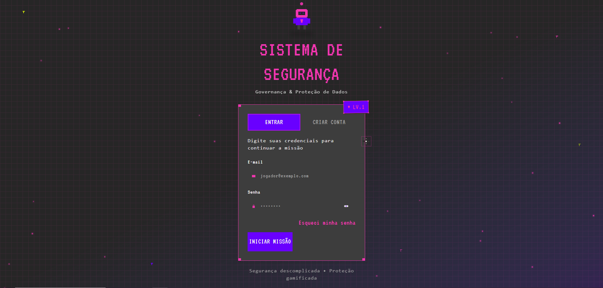
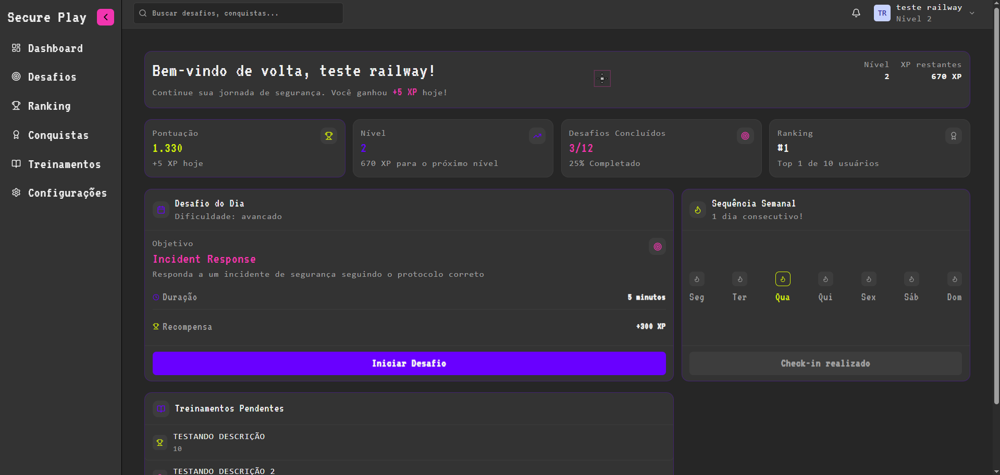
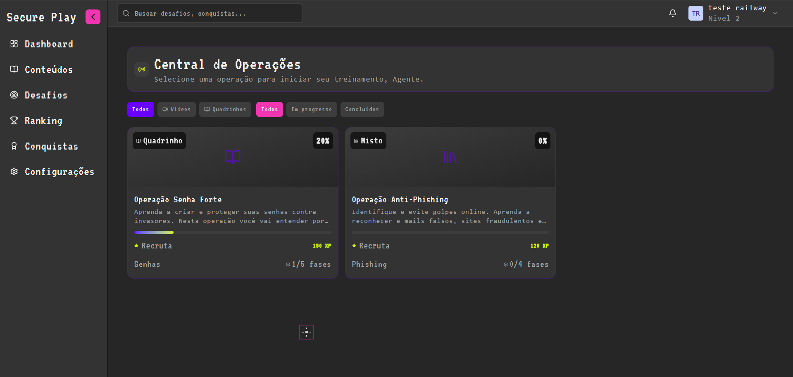
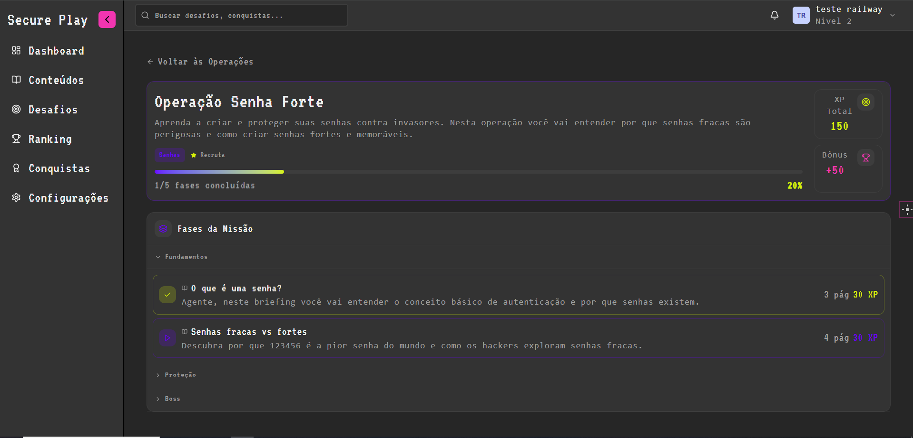
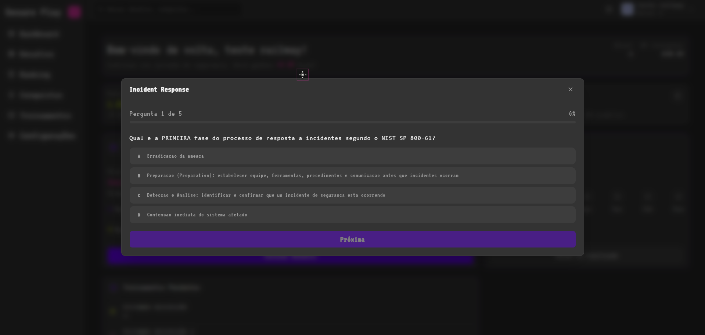
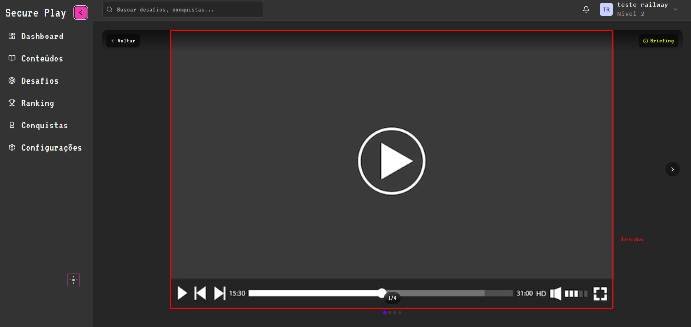

<p align="center">
  
</p>

<h1 align="center">SecurePlay</h1>

<p align="center">
  Plataforma gamificada de treinamento em Segurança da Informação.<br/>
  Aprenda sobre governança, proteção de dados e resposta a incidentes — jogando.
</p>

<p align="center">
  
  
  
  
  
</p>

---

## Sobre o Projeto

SecurePlay transforma o aprendizado de segurança da informação em uma experiência interativa com mecânicas de jogos. Usuários progridem por módulos de conteúdo, respondem quizzes contextualizados, completam desafios diários e acumulam XP para subir de nível — tudo dentro de uma interface temática inspirada em terminais e operações de segurança.

**Público-alvo:** Colaboradores de empresas e estudantes que precisam aprender boas práticas de segurança de forma engajante.

---

## Funcionalidades

| Feature | Descrição |
|---------|-----------|
|  Dashboard personalizado | Visão geral de progresso, XP, ranking e desafio do dia |
|  Módulos de conteúdo | Operações temáticas com vídeo-aulas e materiais em fases |
|  Quizzes interativos | Perguntas baseadas em frameworks reais (NIST, ISO 27001) |
|  Sistema de XP e Níveis | Gamificação com pontuação, conquistas e ranking |
|  Desafios diários | Exercícios com recompensa para manter a sequência |
|  Sequência semanal | Check-in diário para incentivar constância |
|  Vídeo-aulas | Player integrado com briefing e progresso por aula |
|  Notificações em tempo real | WebSocket para alertas e atualizações |

---

## Screenshots

<details>
<summary><strong>Dashboard</strong></summary>
<br/>

</details>

<details>
<summary><strong>Central de Operações (Conteúdos)</strong></summary>
<br/>

</details>

<details>
<summary><strong>Seleção de Aula</strong></summary>
<br/>

</details>

<details>
<summary><strong>Quiz Interativo</strong></summary>
<br/>

</details>

<details>
<summary><strong>Vídeo-aula</strong></summary>
<br/>

</details>

---

## Arquitetura & Stack

```
┌─────────────┐       ┌─────────────┐       ┌───────────┐
│   Frontend  │◄─────►│   Backend   │◄─────►│   MySQL   │
│  React/Vite │  REST │   NestJS    │       │  TypeORM  │
│  Tailwind   │  + WS │  Fastify    │       └───────────┘
└─────────────┘       │  JWT + RBAC │       ┌───────────┐
                      │             │◄─────►│   Redis   │
                      └─────────────┘       │  Sessions │
                                            └───────────┘
```

**Frontend:** React 18, TypeScript, Vite, TailwindCSS, Radix UI, Framer Motion, React Router, Axios

**Backend:** NestJS, TypeORM, Fastify, JWT Authentication com RBAC (Role-Based Access Control), Class Validator, WebSocket Gateway

**Infraestrutura:** MySQL 8, Redis (gerenciamento de tokens e sessões), AWS S3 (upload de conteúdo)

---

## Destaques Técnicos

- **Autenticação JWT com refresh token** gerenciado via Redis
- **Controle de acesso por roles** (Admin, Usuário) com guards customizados
- **Ownership guard** — usuários só acessam seus próprios recursos
- **WebSocket** para notificações em tempo real
- **Upload de mídia** via AWS S3
- **Arquitetura modular** — cada domínio isolado em seu próprio módulo NestJS
- **Validação de entrada** com class-validator e DTOs tipados

---

## Como Executar

<details>
<summary><strong>Pré-requisitos</strong></summary>

- Node.js >= 20
- MySQL 8
- Redis
- npm

</details>

<details>
<summary><strong>Instalação</strong></summary>

```bash
git clone https://github.com/Guilherme-Fadel/SecurePlay.git
cd SecurePlay

# Frontend
cd frontend
npm install

# Backend
cd ../backend
npm install
```

Configure as variáveis de ambiente no `backend/.env`:

```env
DATABASE_HOST=
DATABASE_PORT=
DATABASE_USER=
DATABASE_PASSWORD=
DATABASE_NAME=

REDIS_HOST=
REDIS_PORT=
REDIS_PASSWORD=

JWT_SECRET=
```

</details>

<details>
<summary><strong>Executando</strong></summary>

```bash
# Frontend (porta 5173)
cd frontend
npm run dev

# Backend (porta 3000)
cd backend
npm run start:dev
```

</details>
